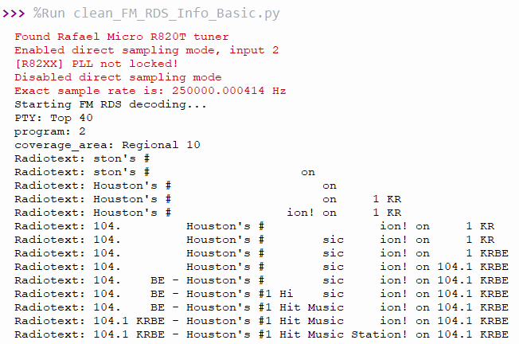

# FM + RDS Decoder using Python + RTL-SDR

This project decodes FM radio and extracts **RDS (Radio Data System)** information from IQ samples or live RTL-SDR input. Built with **Python**, **NumPy**, and **signal processing** techniques.

---

## Project Files

| File | Description |
|------|-------------|
| `fm_rds_decoder.py` | Main decoder script |

## Requirements

- Python 3.x
- NumPy
- SciPy
- (Optional) `pyrtlsdr` for RTL-SDR support

### Install

```bash
pip install numpy scipy pyrtlsdr
```


## Features

- FM Demodulation
- Stereo support
- RDS extraction at 57 kHz
- Group decoding (PS, RT, CT)

## Sample Output



## Author
Soham Samantaray
GitHub: CoalitionStorm

## License
This project is open-source and intended for educational use.
